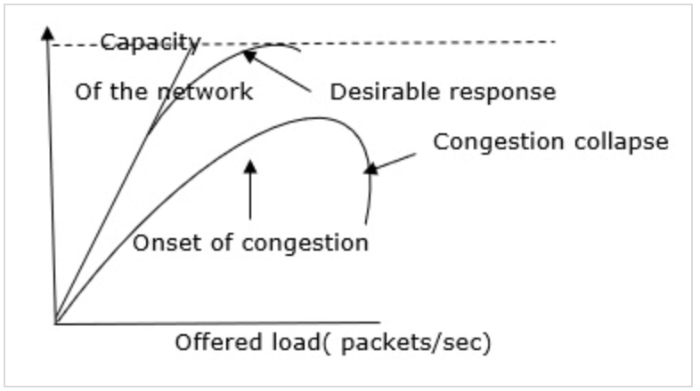
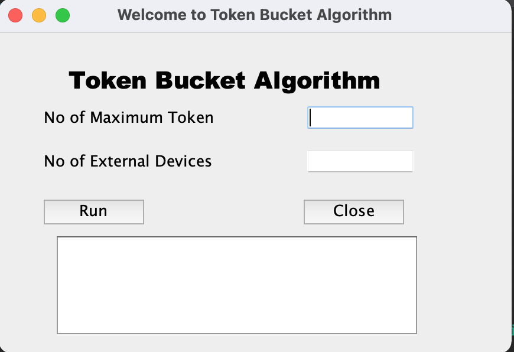
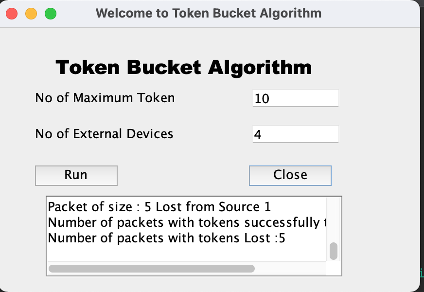
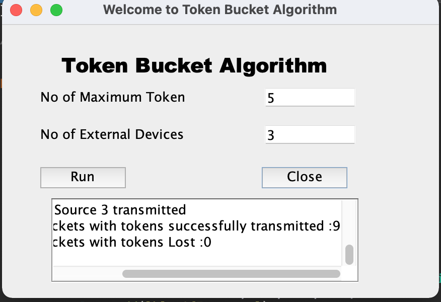

# Token Bucket Algorithm
Token bucket algorithm is one of the techniques for congestion control algorithms. When too many packets are present in the network it causes packet delay and loss of packet which degrades the performance of the system. This situation is called congestion.

The network layer and transport layer share the responsibility for handling congestions. One of the most effective ways to control congestion is trying to reduce the load that transport layer is placing on the network. To maintain this network and transport layers have to work together.

The Token Bucket Algorithm is diagrammatically represented as follows

The leaky bucket algorithm enforces output patterns at the average rate, no matter how busy the traffic is. So, to deal with the more traffic, we need a flexible algorithm so that the data is not lost. One such approach is the Token Bucket Algorithm.

Let us understand this algorithm step wise as given below −
1. In regular intervals tokens are thrown into the bucket f.
2. The bucket has a maximum capacity f.
3. If the packet is ready, then a token is removed from the bucket, and the packet is sent.
4. Suppose, if there is no token in the bucket, the packet cannot be sent.

## Simulations
### Images

### Video

https://user-images.githubusercontent.com/66853419/143533681-8dba5849-d7a2-40a0-aca8-ebe5cc2a4356.mp4

